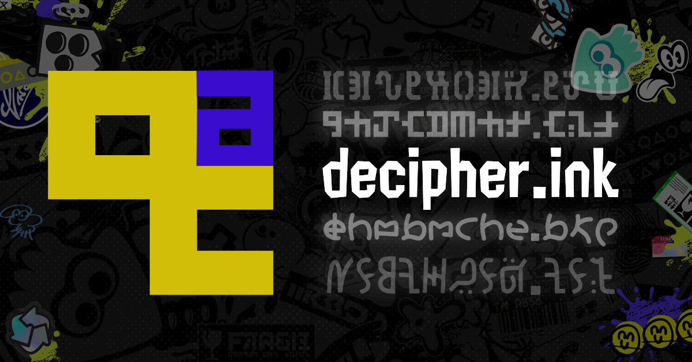

# decipher.ink

decipher.ink is a site that allows you to translate between the [scripts found in Splatoon](https://splatoonwiki.org/wiki/Inkling_(language)) and english.

## Contact
I'd love to hear your thoughts on the website, please reach out if you have any questions or suggestions!
* [discord](https://discord.com/users/569822515401195520)
* [twitter](https://twitter.com/kerfuzzle_)

## Bug reports
Create an issue in the [issues tab](https://github.com/kerfuzzle/decipher.ink/issues) or just send me a message directly through either of the above links.

## Acknowledgements

Many thanks to these cool people who deciphered the scripts, this definitely wouldn't be possible without them!

* [@ardnin_](https://twitter.com/ardnin_)
* [@rassicas](https://twitter.com/rassicas)
* [@cosmo_splt](https://twitter.com/cosmo_splt)
* [@splattershot_jr](https://twitter.com/splattershot_jr)
* [jacebeleren](https://jacebeleren.tumblr.com/)
* [alalehaz](https://inklanguage.blogspot.com/)
